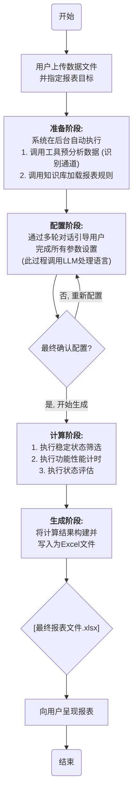
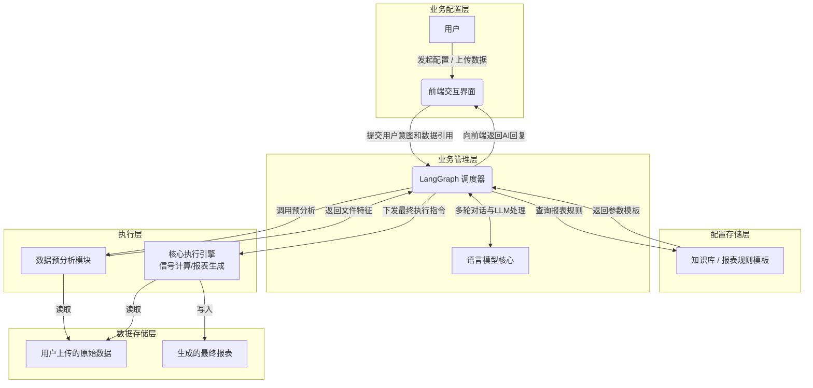

AI 对话式报表生成功能 - 最终开发技术文档
版本: 1.0
日期: 2025-09-15

1.0 项目概述
1.1 项目目标
本项目旨在为 DHDAS 软件的“分析”模式，开发一个集成的、智能化的对话式报表生成功能。该功能将取代传统的手动配置流程，通过 AI 引导式对话，帮助用户从上传的数据源文件中，快速、准确地生成包含三类核心分析（稳定状态、功能计算、状态评估）的专业 Excel 报表。

1.2 核心功能

- 对话式配置：通过纯自然语言对话，引导用户完成所有报表参数的配置。
- 动态报表生成：根据用户在对话中确定的参数，动态生成包含以下一项或多项内容的报表：

  - 稳定状态参数汇总表
  - 功能计算汇总表
  - 状态评估表

- Excel 文件导出：将最终生成的报表（包含数据表和图表）导出为.xlsx 格式的文件。

  1.3 技术栈

- 后端: Python

- 前端: Electron + React.js

- Excel 处理库: openpyxl (或 XlsxWriter)

  2.0 系统设计
  2.1 系统全流程图
  本流程图以业务动作为核心，展示了从用户发起请求到最终交付报表的端到端完整流程，包含了关键的决策分支和工具调用环节。



2.2 系统体系结构
系统采用五层架构模型，确保各部分职责清晰。



3.0 详细技术规格
3.1 前端开发规范 (Frontend Specification)

1. 核心组件:

- ChatContainer: 对话主容器，需实现虚拟滚动以优化长对话性能。

- MessageBubble: 消息气泡组件，Props: { author: 'AI' | 'user', content: string, timestamp: string, status: 'sent' | 'pending' | 'error' }。

- ChoiceSelector: 引导选项组件，Props: { choices: string[] }，点击后触发 onSelect 事件。

- FileUpload: 文件上传组件，集成在对话流中。

2. 状态管理:
   需建立一个集中的状态管理库（Store），管理 session_id, uploaded_file_id, message_history, current_dialogue_state, is_loading, report_url 等核心状态。

3. API 通信:

- 端点: POST /api/ai_report/dialogue

- 请求体: { session_id, file_id, user_input, dialogue_state }

- 响应体: { session_id, ai_response, quick_choices, dialogue_state, is_complete, report_url }

  3.2 后端开发规范 (Backend Specification)

1. 核心类与接口定义 (Python 风格):

- 数据服务接口:

  - DataReader (抽象基类): 定义数据读取器规范。核心方法: read(self, file_path: str, channel_names: list[str]) -> list。
  - ReportWriter (抽象基类): 定义报表写入器规范。核心方法: write(self, output_path: str, report_data: dict)。

- 报表计算引擎接口与核心类:

  - Analyzer (抽象基类): 定义所有分析器策略的接口。核心方法: analyze(self, data: list, config: dict) -> dict。
  - ReportCalculationEngine (核心类): 核心计算引擎，负责调度 Analyzer 策略。核心方法: generate(self, data: list, full_config: dict) -> dict。

- 对话管理核心类与辅助接口:

  - DialogueManager (核心类): 管理对话流程。核心方法: process(self, user_request: dict) -> dict。
  - NluProcessor (抽象基类): 定义自然语言理解单元接口。核心方法: process_text(self, text: str, context: dict) -> dict。
  - RuleProvider (抽象基类): 定义规则提供者接口。核心方法: get_report_template(self, report_type: str) -> dict。

2. 模块实现详述:

- 职责边界: 必须严格遵守 LLM 与计算引擎的职责分离。LLM 仅用于对话管理，所有数值分析均在执行层由确定性工具完成。

- 计算逻辑: 所有 Analyzer 的算法实现，必须严格遵循**《输出报表定制研发任务书》**中的定义。

  3.3 数据结构定义：报表配置 JSON 模板
  这是由对话模块生成、并传递给计算引擎的核心指令蓝图。

```json
// 这是一个完整的配置示例
{
  "sourceFileId": "user_uploaded_file_temp_id_12345",
  "reportConfig": {
    // sections字段是一个任务清单，告诉引擎需要生成哪几部分报表
    "sections": ["stableState", "functionalCalc", "statusEval"],

    // 稳定状态表配置，所有参数均来自任务书
    "stableState": {
      "displayChannels": ["Ng(rpm)", "Temperature(°C)"],
      "condition": {
        "channel": "Ng(rpm)",
        "statistic": "平均值", // 可选值: "最大值", "最小值", "平均值", "有效值"
        "duration": 1, // 单位: 秒
        "logic": ">", // 可选值: ">", "<"
        "threshold": 15000
      }
    },

    // 功能计算表配置，每个键代表一列表，其参数定义来自任务书
    "functionalCalc": {
      "time_base": {
        "channel": "Pressure(kPa)",
        "statistic": "平均值",
        "duration": 1,
        "logic": ">",
        "threshold": 500
      },
      "startup_time": {
        "channel": "Pressure(kPa)",
        "statistic": "平均值",
        "duration": 1,
        "logic": ">",
        "threshold": 1000
      },
      "ignition_time": {
        "channel": "Temperature(°C)",
        "duration": 10,
        "logic": "突变>",
        "threshold": 50
      },
      "rundown_ng": {
        "channel": "Ng(rpm)",
        "threshold1": 8000,
        "threshold2": 1000
      }
    },

    // 状态评估表配置，evaluations数组中的每个对象代表一行评估
    "statusEval": {
      "evaluations": [
        {
          "item": "超温",
          "channel": "Temperature(°C)",
          "logic": "<",
          "threshold": 850
        },
        { "item": "Ng余转时间", "logic": ">", "threshold": 50 }
      ]
    }
  }
}
```

4.0 开发与测试方案
4.1 分阶段开发计划
第一阶段：后端基础与接口契约 (建议周期: 1 周)

任务: 搭建后端项目骨架，定义所有模块间的接口和数据模型，产出 API 文档和 Mock 服务。

交付物: 可运行的后端项目骨架、详尽的 API 文档、可供前端调用的 Mock API 服务。

第二阶段：核心功能实现与单元测试 (建议周期: 2-3 周)

任务: 在“无头”模式下，实现所有确定性的数据分析和报表生成逻辑，并保证其 100%的准确性。

交付物: 功能完整的后端计算引擎、一套完整的单元和集成测试用例、一个可独立完成“读取配置+读取数据->生成报表”的测试脚本。

第三阶段：对话流程与前后端集成 (建议周期: 2 周)

任务: 开发前端对话界面，实现智能对话逻辑，并将所有部分连接成一个完整、可用的产品。

交付物: 一个功能完整的、可交付的 AI 报表生成软件模块。

4.2 分阶段测试与验收标准
第一阶段验收:

标准: 检查项目结构和代码骨架是否符合规范；使用 API 工具（如 Postman）调用 Mock API，验证其请求和响应是否与 API 文档完全一致。

第二阶段验收:

标准:

所有单元测试 100%通过。

（关键）运行集成测试脚本，将生成的 Excel 报表与一份预先制作的“金标准”报表进行比对，每一个单元格的数值和文本都必须完全一致。

第三阶段验收:

标准:

（关键）通过前端 UI 完整操作生成的报表，必须与第二阶段的“金标准”报表内容完全一致。

对话流程符合预期，能够正确处理用户输入和修正。

所有可预见的异常情况（如上传错误文件、输入无效参数）都能被系统捕获，并向用户提供清晰、友好的提示。
