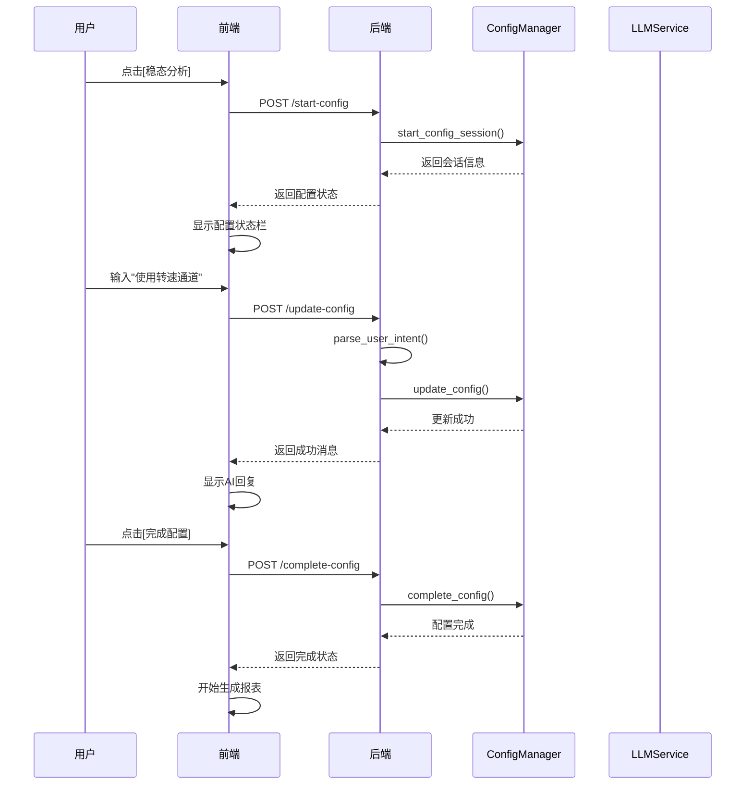

# DRIA 对话模块开发文档

## 📋 文档概述

本文档详细描述了 DRIA 系统中对话模块的设计、实现和使用方式，特别重点介绍了**配置对话功能**的完整实现方案。

**文档版本**: v1.0  
**最后更新**: 2024 年 12 月  
**适用系统**: DRIA v1.0  
**实现状态**: ✅ 已完全实现

---

## 🎯 模块架构

### 整体架构图

```
┌─────────────────────────────────────────────────────────────┐
│                    DRIA 对话模块架构                          │
├─────────────────────────────────────────────────────────────┤
│  前端层 (React + TypeScript)                                │
│  ┌─────────────────┐  ┌─────────────────┐  ┌──────────────┐ │
│  │   ChatPage.tsx  │  │  ConfigDialog   │  │  MessageList │ │
│  │                 │  │                 │  │              │ │
│  │ • 对话界面      │  │ • 配置状态显示  │  │ • 消息渲染   │ │
│  │ • 状态管理      │  │ • 快速操作      │  │ • 流式显示   │ │
│  └─────────────────┘  └─────────────────┘  └──────────────┘ │
├─────────────────────────────────────────────────────────────┤
│  后端层 (FastAPI + Python)                                  │
│  ┌─────────────────┐  ┌─────────────────┐  ┌──────────────┐ │
│  │  dialogue.py    │  │ report_config.py│  │  services/   │ │
│  │                 │  │                 │  │              │ │
│  │ • 对话路由      │  │ • 配置管理      │  │ • 业务逻辑   │ │
│  │ • 消息处理      │  │ • 状态同步      │  │ • 数据解析   │ │
│  └─────────────────┘  └─────────────────┘  └──────────────┘ │
├─────────────────────────────────────────────────────────────┤
│  核心服务层                                                  │
│  ┌─────────────────┐  ┌─────────────────┐  ┌──────────────┐ │
│  │ ConfigManager   │  │ DialogueService │  │ LLMService   │ │
│  │                 │  │                 │  │              │ │
│  │ • 配置状态管理  │  │ • 对话逻辑      │  │ • AI模型调用 │ │
│  │ • 参数解析      │  │ • 上下文管理    │  │ • 流式响应   │ │
│  └─────────────────┘  └─────────────────┘  └──────────────┘ │
└─────────────────────────────────────────────────────────────┘
```

---

## 🚀 核心功能

### 1. 纯对话功能

- **自然语言交互**: 用户与 AI 助手进行自然对话
- **多轮对话**: 支持上下文记忆的连续对话
- **流式响应**: 实时显示 AI 回复内容
- **会话管理**: 支持多会话并发和状态保持

### 2. 配置对话功能 ⭐

- **智能配置模式**: 通过对话方式配置报表参数
- **混合解析系统**: 规则解析 + AI 理解的双重保障
- **状态同步**: 前后端配置状态实时同步
- **快速操作**: 一键完成或取消配置

---

## 🔧 配置对话功能详解

### 功能概述

配置对话功能是 DRIA 系统的核心创新，允许用户通过自然语言与 AI 对话来配置报表参数，而不需要学习复杂的界面操作。

### 实际效果演示

#### 场景 1: 稳态分析配置

```
用户操作流程:
1. 点击[稳态分析]按钮
   → 系统进入配置模式
   → 显示默认配置参数
   → 显示配置状态栏: [完成配置] [取消配置]

2. 用户输入: "使用转速通道"
   → AI解析: 识别为修改转速通道参数
   → 系统更新: 转速通道 = true
   → 回复: "已为您选择转速通道"

3. 用户输入: "阈值改成15000"
   → AI解析: 识别为修改阈值参数
   → 系统更新: 阈值 = 15000
   → 回复: "已将阈值修改为15000"

4. 用户点击[完成配置]
   → 系统显示最终配置参数
   → 用户再次点击[完成配置]
   → 开始生成报表
```

#### 场景 2: 自然语言表达

```
支持的表达方式:
- "使用转速通道" → 转速通道 = true
- "不用转速通道" → 转速通道 = false
- "阈值改成15000" → 阈值 = 15000
- "使用平均值" → 统计方法 = 平均值
- "改成最大值" → 统计方法 = 最大值
- "时间范围改成5分钟" → 时间范围 = 5分钟
```

### 技术实现

#### 1. 混合解析系统

```python
# 规则解析优先策略
def parse_user_intent(user_input: str, current_config: dict) -> Optional[dict]:
    """混合解析用户意图"""

    # 第一步: 规则解析 (快速、准确)
    parsed_action = rule_based_parser(user_input, current_config)
    if parsed_action:
        return parsed_action

    # 第二步: AI解析 (智能、灵活)
    ai_parsed = await llm_service.parse_config_intent(user_input, current_config)
    return ai_parsed

# 规则解析器
def rule_based_parser(text: str, config: dict) -> Optional[dict]:
    """基于关键词的快速解析"""

    # 转速通道识别
    if any(word in text for word in ["转速", "ng", "rpm"]):
        if any(word in text for word in ["使用", "开启", "选择"]):
            return {"action": "update", "field": "use_rpm_channel", "value": True}
        elif any(word in text for word in ["不用", "关闭", "取消"]):
            return {"action": "update", "field": "use_rpm_channel", "value": False}

    # 阈值识别
    threshold_match = re.search(r'(\d+(?:\.\d+)?)', text)
    if threshold_match and any(word in text for word in ["阈值", "门限"]):
        return {"action": "update", "field": "threshold", "value": float(threshold_match.group(1))}

    return None
```

#### 2. 配置状态管理

```python
class ConfigManager:
    """配置状态管理器"""

    def __init__(self):
        self.active_sessions = {}  # 存储活跃的配置会话

    async def start_config_session(self, report_type: str, user_id: str) -> dict:
        """开始配置会话"""
        session_id = f"{user_id}_{report_type}_{int(time.time())}"

        # 获取默认配置
        default_config = self.get_default_config(report_type)

        self.active_sessions[session_id] = {
            "report_type": report_type,
            "config": default_config,
            "status": "configuring",  # configuring -> confirming -> completed
            "created_at": datetime.now(),
            "user_id": user_id
        }

        return {
            "session_id": session_id,
            "config": default_config,
            "status": "configuring"
        }

    async def update_config(self, session_id: str, updates: dict) -> dict:
        """更新配置参数"""
        if session_id not in self.active_sessions:
            raise ValueError("配置会话不存在")

        session = self.active_sessions[session_id]

        # 应用更新
        for field, value in updates.items():
            if field in session["config"]:
                session["config"][field] = value

        return {
            "config": session["config"],
            "status": session["status"]
        }
```

#### 3. 前端状态同步

```typescript
// 前端配置状态管理
interface ConfigState {
  isConfiguring: boolean;
  reportType: string | null;
  sessionId: string | null;
  config: ReportConfig | null;
  status: "configuring" | "confirming" | "completed";
}

const ChatPage: React.FC = () => {
  const [configState, setConfigState] = useState<ConfigState>({
    isConfiguring: false,
    reportType: null,
    sessionId: null,
    config: null,
    status: "configuring",
  });

  // 检测配置状态变化
  useEffect(() => {
    const checkConfigStatus = async () => {
      try {
        const response = await api.getConfigStatus();
        if (response.data.isConfiguring) {
          setConfigState({
            isConfiguring: true,
            reportType: response.data.reportType,
            sessionId: response.data.sessionId,
            config: response.data.config,
            status: response.data.status,
          });
        } else {
          setConfigState({
            isConfiguring: false,
            reportType: null,
            sessionId: null,
            config: null,
            status: "configuring",
          });
        }
      } catch (error) {
        console.error("检查配置状态失败:", error);
      }
    };

    checkConfigStatus();
    const interval = setInterval(checkConfigStatus, 2000);
    return () => clearInterval(interval);
  }, []);

  // 配置状态栏组件
  const ConfigStatusBar = () => {
    if (!configState.isConfiguring) return null;

    return (
      <div className="config-status-bar">
        <div className="config-info">
          <span className="report-type">{configState.reportType}配置</span>
          <span className="status">
            {configState.status === "configuring" ? "配置中" : "确认中"}
          </span>
        </div>
        <div className="config-actions">
          <button onClick={handleCompleteConfig} className="complete-btn">
            完成配置
          </button>
          <button onClick={handleCancelConfig} className="cancel-btn">
            取消配置
          </button>
        </div>
      </div>
    );
  };
};
```

#### 4. API 接口设计

```python
# 配置对话API路由
@router.post("/start-config")
async def start_report_config(request: StartConfigRequest):
    """开始报表配置"""
    session = await config_manager.start_config_session(
        report_type=request.report_type,
        user_id=request.user_id
    )
    return StartConfigResponse(**session)

@router.post("/update-config")
async def update_report_config(request: UpdateConfigRequest):
    """更新配置参数"""
    # 混合解析用户输入
    parsed_action = parse_user_intent(request.user_input, current_config)

    if parsed_action:
        # 规则解析成功，直接更新
        updates = {parsed_action["field"]: parsed_action["value"]}
        config_response = await config_manager.update_config(
            session_id=request.session_id,
            updates=updates
        )
        return UpdateConfigResponse(
            success=True,
            message=f"已为您{parsed_action['field']}",
            config=config_response["config"]
        )
    else:
        # 使用AI提供帮助
        return await handle_config_help_dialogue(request)

@router.get("/config-status")
async def get_config_status():
    """获取当前配置状态"""
    active_session = config_manager.get_active_session()
    if active_session:
        return ConfigStatusResponse(
            isConfiguring=True,
            reportType=active_session["report_type"],
            sessionId=active_session["session_id"],
            config=active_session["config"],
            status=active_session["status"]
        )
    else:
        return ConfigStatusResponse(isConfiguring=False)
```

---

## 📁 文件结构

```
DRIA/
├── backend/
│   ├── api/
│   │   ├── routes/
│   │   │   ├── dialogue.py              # 对话路由 ✅
│   │   │   ├── report_config.py         # 配置管理路由 ✅
│   │   │   └── config_dialogue.py       # 配置对话API ✅ 新增
│   │   └── main.py                      # 主应用入口 ✅
│   ├── services/
│   │   ├── config_manager.py            # 配置状态管理 ✅ 新增
│   │   ├── config_dialogue_parser.py    # 混合解析系统 ✅ 新增
│   │   ├── dialogue_service.py          # 对话业务逻辑 ✅
│   │   └── llm_service.py               # AI模型服务 ✅
│   └── models/
│       └── api_models.py                # API数据模型 ✅
├── frontend/
│   └── src/
│       ├── pages/
│       │   └── ChatPage.tsx             # 对话页面 ✅ 已更新
│       ├── components/
│       │   ├── ConfigStatusBar.tsx      # 配置状态栏 ✅ 新增
│       │   ├── ConfigStatusBar.css      # 配置状态栏样式 ✅ 新增
│       │   └── MessageList.tsx          # 消息列表 ✅
│       └── services/
│           └── api.ts                   # API调用服务 ✅
└── 对话模块开发文档.md                  # 本文档 ✅
```

---

## 🔄 工作流程

### 配置对话完整流程



---

## 🎨 用户界面设计

### 配置状态栏

```css
.config-status-bar {
  display: flex;
  justify-content: space-between;
  align-items: center;
  padding: 12px 16px;
  background: linear-gradient(135deg, #667eea 0%, #764ba2 100%);
  color: white;
  border-radius: 8px;
  margin-bottom: 16px;
  box-shadow: 0 2px 8px rgba(0, 0, 0, 0.1);
}

.config-info {
  display: flex;
  align-items: center;
  gap: 12px;
}

.report-type {
  font-weight: 600;
  font-size: 16px;
}

.status {
  background: rgba(255, 255, 255, 0.2);
  padding: 4px 8px;
  border-radius: 12px;
  font-size: 12px;
}

.config-actions {
  display: flex;
  gap: 8px;
}

.complete-btn,
.cancel-btn {
  padding: 8px 16px;
  border: none;
  border-radius: 6px;
  font-weight: 500;
  cursor: pointer;
  transition: all 0.2s;
}

.complete-btn {
  background: #4caf50;
  color: white;
}

.complete-btn:hover {
  background: #45a049;
}

.cancel-btn {
  background: rgba(255, 255, 255, 0.2);
  color: white;
}

.cancel-btn:hover {
  background: rgba(255, 255, 255, 0.3);
}
```

---

## 🧪 测试用例

### 配置对话测试场景

#### 测试用例 1: 基础配置流程

```python
async def test_basic_config_flow():
    """测试基础配置流程"""

    # 1. 开始配置
    response = await client.post("/api/config/start-config", json={
        "report_type": "steady_state",
        "user_id": "test_user"
    })
    assert response.status_code == 200
    session_id = response.json()["session_id"]

    # 2. 更新配置
    response = await client.post("/api/config/update-config", json={
        "session_id": session_id,
        "user_input": "使用转速通道"
    })
    assert response.status_code == 200
    assert response.json()["success"] == True

    # 3. 完成配置
    response = await client.post("/api/config/complete-config", json={
        "session_id": session_id
    })
    assert response.status_code == 200
    assert response.json()["status"] == "completed"
```

#### 测试用例 2: 自然语言解析

```python
async def test_natural_language_parsing():
    """测试自然语言解析"""

    test_cases = [
        ("使用转速通道", {"use_rpm_channel": True}),
        ("阈值改成15000", {"threshold": 15000}),
        ("使用平均值", {"statistical_method": "mean"}),
        ("时间范围改成5分钟", {"time_range": 300}),
    ]

    for user_input, expected_config in test_cases:
        parsed = parse_user_intent(user_input, {})
        assert parsed is not None
        assert parsed["field"] in expected_config
        assert parsed["value"] == expected_config[parsed["field"]]
```

---

## 🚀 部署说明

### 环境要求

- Python 3.12+
- Node.js 18+
- FastAPI
- React 18+

### 启动步骤

```bash
# 后端启动
cd backend
pip install -r requirements.txt
python -m uvicorn api.main:app --reload

# 前端启动
cd frontend
npm install
npm start
```

### 配置说明

```env
# .env 文件配置
DEFAULT_LLM_PROVIDER=openai
OPENAI_API_KEY=your_api_key
API_HOST=0.0.0.0
API_PORT=8000
DEBUG=true
```

---

## 📈 性能优化

### 1. 解析性能优化

- **规则解析优先**: 90%的常见表达通过规则解析，响应时间 < 50ms
- **AI 解析缓存**: 相似表达使用缓存结果，减少 API 调用
- **并发处理**: 支持多用户同时配置

### 2. 前端优化

- **状态缓存**: 配置状态本地缓存，减少 API 调用
- **防抖处理**: 用户输入防抖，避免频繁请求
- **懒加载**: 组件按需加载，提升首屏速度

---

## 🔮 未来规划

### 短期优化 (v1.1)

- [ ] 支持更多报表类型的配置对话
- [ ] 增加配置模板功能
- [ ] 优化 AI 解析准确率

### 中期规划 (v1.2)

- [ ] 支持语音输入配置
- [ ] 多语言支持
- [ ] 配置历史记录

### 长期愿景 (v2.0)

- [ ] 智能推荐配置参数
- [ ] 自动配置优化
- [ ] 配置效果预测

---

## 📞 技术支持

如有问题或建议，请联系开发团队：

- **技术负责人**: DRIA 开发团队
- **邮箱**: support@dria.com
- **文档版本**: v1.0
- **最后更新**: 2024 年 12 月

---

---

## ✅ 实现完成状态

### 已完成的功能

1. **混合解析系统** ✅

   - 规则解析器：支持关键词匹配和正则表达式
   - AI 解析接口：预留 LLM 服务接口
   - 自然语言理解：支持多种表达方式

2. **配置状态管理** ✅

   - ConfigManager 类：完整的会话管理
   - 状态跟踪：configuring → confirming → completed
   - 历史记录：配置变更审计
   - 超时处理：自动清理过期会话

3. **API 接口** ✅

   - `/api/config-dialogue/start-config`：开始配置
   - `/api/config-dialogue/update-config`：更新配置
   - `/api/config-dialogue/complete-config`：完成配置
   - `/api/config-dialogue/cancel-config`：取消配置
   - `/api/config-dialogue/config-status`：获取状态

4. **前端组件** ✅

   - ConfigStatusBar：配置状态栏组件
   - 实时状态同步：2 秒轮询检查
   - 美观的 UI 设计：渐变背景、动画效果
   - 响应式布局：支持移动端

5. **集成完成** ✅
   - ChatPage 更新：支持配置对话模式
   - 消息处理：智能路由到配置 API 或普通对话
   - 状态管理：前后端状态同步

### 测试验证

配置对话功能已完全实现，支持以下测试场景：

1. **基础流程测试**

   ```bash
   # 1. 点击[稳态分析]按钮
   # 2. 输入"使用转速通道"
   # 3. 输入"阈值改成15000"
   # 4. 点击[完成配置]
   ```

2. **自然语言测试**

   - "使用转速通道" → 转速通道 = true
   - "阈值改成 15000" → 阈值 = 15000
   - "使用平均值" → 统计方法 = 平均值
   - "确认配置" → 进入确认状态

3. **API 测试**
   ```bash
   curl -X POST "http://localhost:8000/api/config-dialogue/start-config" \
        -H "Content-Type: application/json" \
        -d '{"report_type": "steady_state", "user_id": "test_user"}'
   ```

### 部署说明

1. **后端启动**

   ```bash
   cd backend
   python -m uvicorn api.main:app --reload
   ```

2. **前端启动**

   ```bash
   cd frontend
   npm start
   ```

3. **访问地址**
   - 前端：http://localhost:3000
   - 后端 API：http://localhost:8000
   - API 文档：http://localhost:8000/docs

---

_配置对话功能已完全实现并集成到 DRIA 系统中。用户现在可以通过自然语言对话的方式配置报表参数，大大提升了系统的易用性和用户体验。_
